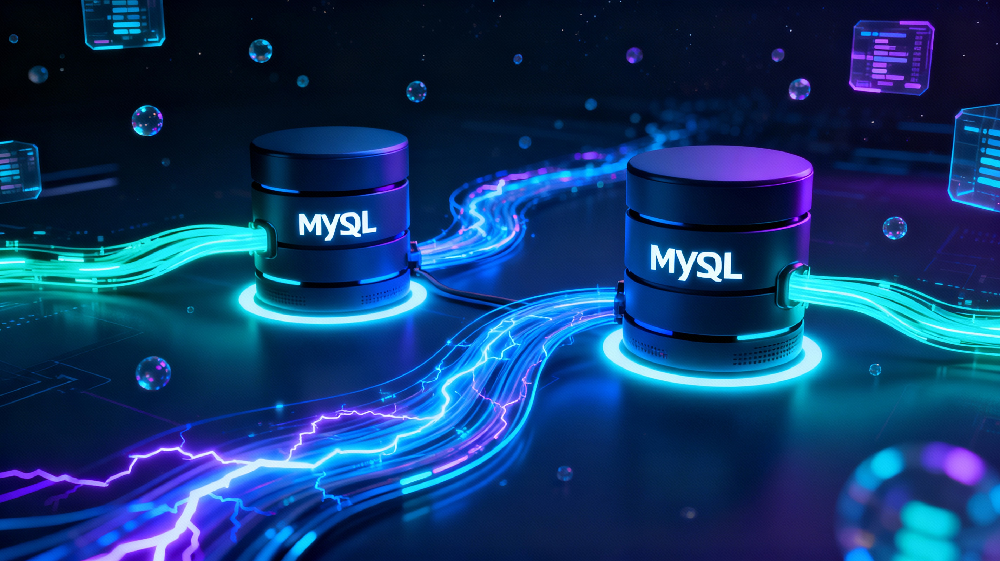

# AutoMySQLSync
表示自動化（Auto）同步（Sync）兩個 MySQL 資料庫的資料。

## 前置作業
[init.md](docs/init.md)

## Debug
[launch.json](.vscode/launch.json)

## pyenv 設定預設的 Python 執行版本
[.python-version](.python-version)
目前是 3.9

## DDL
CREATE TABLE 的 SQL 語法

